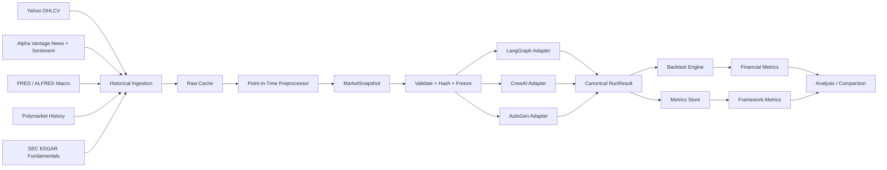
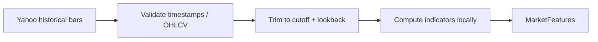
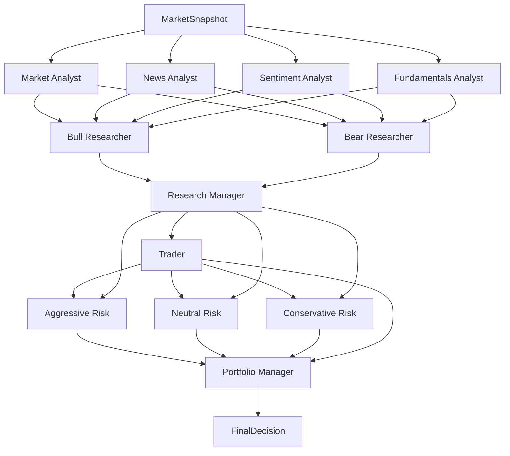

# ARCHITECTURE — Multi-Agent Trading Framework Benchmark

## 1. Architectural principles

1. **Data before agents.** Historical data is prepared independently of LangGraph, CrewAI, and AutoGen.
2. **Point-in-time correctness.** Historical runs may not see future information.
3. **Freeze once, replay many.** A normalized snapshot is persisted and reused by every framework.
4. **Framework-neutral contracts.** Agent inputs/outputs use shared schemas.
5. **LLMs reason; deterministic code calculates.** Data retrieval, indicators, hashing, validation, portfolio accounting, and metrics should not be delegated to an LLM.
6. **Trace everything.** Every LLM call and stage output must be auditable.
7. **Backtesting is downstream.** Never allow future backtest prices into the decision pipeline.
8. **Fail visibly.** Missing data, retries, malformed outputs, and orchestration failures must be recorded.

---

## 2. End-to-end system



---

## 3. Repository layout

Recommended initial layout:

```text
project/
├── README.md
├── pyproject.toml
├── .env.example
├── configs/
│   ├── data.yaml
│   ├── experiment.yaml
│   ├── llm.yaml
│   └── backtest.yaml
├── src/
│   ├── core/
│   │   ├── schemas.py
│   │   ├── enums.py
│   │   ├── hashing.py
│   │   ├── config.py
│   │   └── errors.py
│   │
│   ├── data/
│   │   ├── yahoo.py
│   │   ├── alpha_vantage.py
│   │   ├── fred.py
│   │   ├── polymarket.py
│   │   ├── sec_edgar.py
│   │   ├── indicators.py
│   │   ├── normalizers.py
│   │   ├── validators.py
│   │   ├── snapshot_builder.py
│   │   └── cache.py
│   │
│   ├── agents/
│   │   ├── prompts/
│   │   │   ├── market.md
│   │   │   ├── news.md
│   │   │   ├── sentiment.md
│   │   │   ├── fundamentals.md
│   │   │   ├── bull.md
│   │   │   ├── bear.md
│   │   │   ├── research_manager.md
│   │   │   ├── trader.md
│   │   │   ├── risk_aggressive.md
│   │   │   ├── risk_neutral.md
│   │   │   ├── risk_conservative.md
│   │   │   └── portfolio_manager.md
│   │   ├── contracts.py
│   │   └── prompt_registry.py
│   │
│   ├── llm/
│   │   ├── base.py
│   │   ├── bedrock.py
│   │   └── instrumentation.py
│   │
│   ├── workflows/
│   │   ├── canonical.py
│   │   ├── langgraph_adapter.py
│   │   ├── crewai_adapter.py
│   │   └── autogen_adapter.py
│   │
│   ├── execution/
│   │   ├── runner.py
│   │   ├── retry.py
│   │   ├── run_store.py
│   │   └── resume.py
│   │
│   ├── backtest/
│   │   ├── simulator.py
│   │   ├── portfolio.py
│   │   ├── metrics.py
│   │   └── reports.py
│   │
│   └── analysis/
│       ├── agreement.py
│       ├── divergence.py
│       └── framework_report.py
├── data/
│   ├── raw/
│   ├── normalized/
│   └── snapshots/
├── runs/
│   ├── traces/
│   ├── decisions/
│   └── metrics/
└── tests/
    ├── unit/
    ├── integration/
    ├── leakage/
    ├── contract/
    └── smoke/
```

Keep framework code thin. Business/research logic belongs in `core`, `agents`, and canonical contracts.

---

## 4. Configuration

No research parameter should be scattered through code.

Example:

```yaml
experiment:
  tickers: ["AAPL"]
  start_date: null
  end_date: null
  decision_frequency: null
  timezone: "America/New_York"

data:
  market_lookback_trading_days: 90
  news_lookback_days: 7
  polymarket_required: false

workflow:
  debate_rounds: null

llm:
  provider: "bedrock"
  model_id: null
  temperature: null
  max_tokens: null

backtest:
  execution_rule: null
  sell_semantics: null
  transaction_cost_bps: null
  slippage_bps: null
```

`null` means the research team has not locked the parameter. The application should refuse to launch a full benchmark while critical fields remain null.

---

## 5. Data ingestion architecture

### 5.1 Raw layer

Each connector returns a provider-specific payload plus metadata.

Raw data should be cached by deterministic request key.

```text
provider + endpoint + normalized parameters -> request hash -> cached payload
```

Reasons:
- Prevent repeated API usage.
- Make experiments reproducible.
- Debug provider changes.
- Separate data acquisition from agent execution.

### 5.2 Normalized layer

Provider data is converted into canonical internal structures.

Examples:
- `PriceBar`
- `NewsItem`
- `SentimentObservation`
- `MacroObservation`
- `PredictionMarketObservation`
- `FundamentalFact`

No framework code should import provider-specific SDK objects.

### 5.3 Snapshot layer

`snapshot_builder` gathers normalized inputs for:

```text
(ticker, decision_date, cutoff_timestamp, config_version)
```

It then:

1. applies point-in-time filters
2. computes deterministic technical indicators
3. aggregates sentiment features
4. maps relevant macro observations
5. maps eligible Polymarket observations
6. selects fundamentals available by cutoff
7. validates schemas
8. records availability/missingness
9. serializes canonically
10. computes SHA-256 content hash
11. persists immutable snapshot

---

## 6. Information cutoff

A date is not precise enough for leakage control.

Define a cutoff timestamp.

Example concept:

```text
Decision date: 2025-04-15
Information cutoff: 2025-04-15 16:00 America/New_York
Execution: TBD by backtest design
```

Every source item must satisfy its own availability rule relative to this cutoff.

The cutoff policy must be frozen before full backtesting.

---

## 7. Price and technical pipeline



Recommended indicator computation is deterministic Python code.

Candidate indicators from the project concept:
- SMA/EMA
- RSI
- MACD
- Bollinger Bands
- ATR/volatility
- volume trend
- recent returns

The exact indicator set is configuration/version controlled.

Indicator code must never access bars after the cutoff.

---

## 8. News pipeline

```text
Alpha Vantage NEWS_SENTIMENT
        |
        v
historical time window query
        |
        v
timestamp filter <= cutoff
        |
        v
deduplicate
        |
        v
ticker relevance filtering
        |
        +--> NewsItem[] ------------> News Analyst
        |
        +--> sentiment fields ------> Sentiment aggregation
```

Store the article metadata used to support an agent report.

Avoid asking the LLM to fetch or search for news during a benchmark run.

---

## 9. Sentiment pipeline

The core sentiment source is the historical Alpha Vantage news/sentiment feed.

Deterministic aggregation may calculate:
- article count
- relevance-weighted mean ticker sentiment
- median
- positive/neutral/negative proportions
- maximum positive/negative observation
- recent-vs-window sentiment shift

The Sentiment Analyst receives both:
1. compact deterministic aggregate features
2. selected supporting article-level sentiment records

The LLM interprets the sentiment; it does not calculate the aggregation.

Potential later augmentation:
- historical earnings-call transcript sentiment

Social-media sentiment is deliberately excluded from the core experiment until a reliable historical source is available.

---

## 10. Macro pipeline

For macro series:

```text
FRED API
  + decision-date real-time/vintage parameters
        |
        v
value that was known at the historical cutoff
        |
        v
MacroObservation[]
```

Important distinction:

```text
observation date != publication/availability date
```

Use ALFRED/FRED real-time semantics to avoid revised future values.

Macro series list must be configuration-driven.

---

## 11. Polymarket pipeline

Polymarket is supplementary market-expectation data.

### Two-stage problem

1. Identify a market/event that is legitimately relevant to the investment context.
2. Retrieve its historical probability/price as of the cutoff.

Do not let an LLM freely search today's catalog during benchmark execution.

Recommended architecture:

```text
Pre-built / deterministic market mapping
        |
        v
eligible event/market IDs for date
        |
        v
historical price/trade retrieval
        |
        v
PredictionMarketObservation[]
```

Persist:
- event id
- market id/condition id/token id
- question/title
- outcome
- historical probability/price
- observation timestamp
- selection reason/mapping rule

If nothing relevant exists:
```json
{
  "available": false,
  "reason": "no_relevant_historical_market"
}
```

---

## 12. Fundamentals pipeline

Preferred source: SEC EDGAR.

```text
filings
  |
  v
filter filing/publication timestamp <= cutoff
  |
  v
extract selected financial facts / filing context
  |
  v
FundamentalsSnapshot
```

The Fundamentals Analyst must not receive a later restatement or filing that was unavailable at the historical cutoff.

---

## 13. Canonical agent workflow



The four analysts may run in parallel because they consume the same frozen snapshot and do not depend on each other.

The Bull and Bear researchers may also run in parallel after analyst reports are available.

The three risk analysts may run in parallel after the trader proposal is available.

---

## 14. Canonical workflow interface

Every framework adapter should expose one method conceptually equivalent to:

```python
async def run_workflow(
    snapshot: MarketSnapshot,
    run_context: RunContext,
) -> RunResult:
    ...
```

Where `RunResult` contains:
- all stage outputs
- final decision
- execution trace
- errors/retries
- framework metrics

The adapter must not own data ingestion or backtesting.

---

## 15. LLM adapter

All frameworks call a shared logical model interface.

```python
class LLMClient(Protocol):
    async def generate_structured(
        self,
        *,
        agent_name: str,
        system_prompt: str,
        user_payload: dict,
        output_schema: type,
        run_context: RunContext,
    ) -> StructuredLLMResult:
        ...
```

The Bedrock implementation is responsible for:
- provider request
- structured-output handling
- token extraction
- latency
- pricing/cost estimation
- retries at the provider layer only where configured
- error normalization

Framework adapters must not implement their own independent pricing/token accounting.

---

## 16. Prompt architecture

Prompts are versioned files.

Every prompt must tell the agent:
- role
- allowed input
- task
- output schema
- no external knowledge/fact invention rule
- uncertainty expectations
- prohibition on using future information

Prompt checksum/version is recorded in every run.

For fairness, framework wrappers may adapt message syntax but not semantics.

---

## 17. State model

The canonical state contains explicit fields, not an unstructured growing chat transcript.

Conceptually:

```python
WorkflowState(
    snapshot=...,
    analyst_reports={...},
    bull_report=None,
    bear_report=None,
    research_manager_report=None,
    trader_plan=None,
    risk_reports={...},
    final_decision=None,
)
```

Each stage should receive the minimum state required for its task.

This:
- controls token usage
- reduces accidental framework differences
- makes data flow auditable
- prevents one framework from seeing more context than another

---

## 18. Instrumentation model

### Run-level

```text
run_id
framework
ticker
decision_date
snapshot_hash
config_hash
prompt_bundle_hash
model_id
started_at
finished_at
status
```

### Call-level

```text
call_id
run_id
stage
attempt
input_tokens
output_tokens
latency_ms
cost_usd
status
error_type
```

### Framework-overhead timing

Measure:
- total end-to-end workflow time
- cumulative LLM request time
- cumulative deterministic processing time where material

Possible derived metric:

```text
orchestration_overhead ≈ end_to_end_time - LLM_wait_time - known_external_wait_time
```

Treat this as an approximation and document the measurement method.

---

## 19. Failure model

Normalize errors:

```text
DATA_UNAVAILABLE
DATA_SCHEMA_ERROR
PIT_VIOLATION
LLM_RATE_LIMIT
LLM_TIMEOUT
LLM_PROVIDER_ERROR
STRUCTURED_OUTPUT_INVALID
FRAMEWORK_EXECUTION_ERROR
WORKFLOW_TIMEOUT
BACKTEST_CONFIG_ERROR
```

Retry policy must be deterministic and logged.

Do not drop failed benchmark runs. Workflow success rate is itself a research metric.

---

## 20. Persistence

Recommended early-stage persistence:
- JSON/JSONL for snapshots, traces, and results
- Parquet for tabular normalized data
- SQLite/DuckDB for experiment analysis

A heavy database is unnecessary initially.

Directory concept:

```text
data/snapshots/AAPL/2025-04-15/<hash>.json
runs/<experiment_id>/<framework>/<run_id>.json
runs/<experiment_id>/metrics/calls.parquet
runs/<experiment_id>/metrics/runs.parquet
```

---

## 21. Backtest separation

Input pipeline:
```text
past data -> snapshot -> agents -> decision
```

Evaluation pipeline:
```text
saved decision + future realized prices -> portfolio simulator -> metrics
```

Future realized prices must never be present in `MarketSnapshot`.

The simulator should accept saved decisions so reports can be recomputed without paying for more LLM calls.

---

## 22. Reproducibility identity

A benchmark run should be uniquely explainable by:

```text
snapshot_hash
+ config_hash
+ prompt_bundle_hash
+ model_id
+ framework_version
+ code commit
+ random seed where meaningful
```

Store these fields before full experiments.

---

## 23. Minimum viable technical path

Do not build the whole graph first.

The first meaningful vertical slice is:

```text
Yahoo historical data
-> snapshot
-> Market Analyst
-> structured report
-> saved trace
```

Then:

```text
+ Alpha Vantage
+ FRED/ALFRED
+ Polymarket
+ fundamentals
```

Then full agents.

Then framework replication.

This is intentionally different from an MVP product mindset: each phase is an experimental validation gate.
